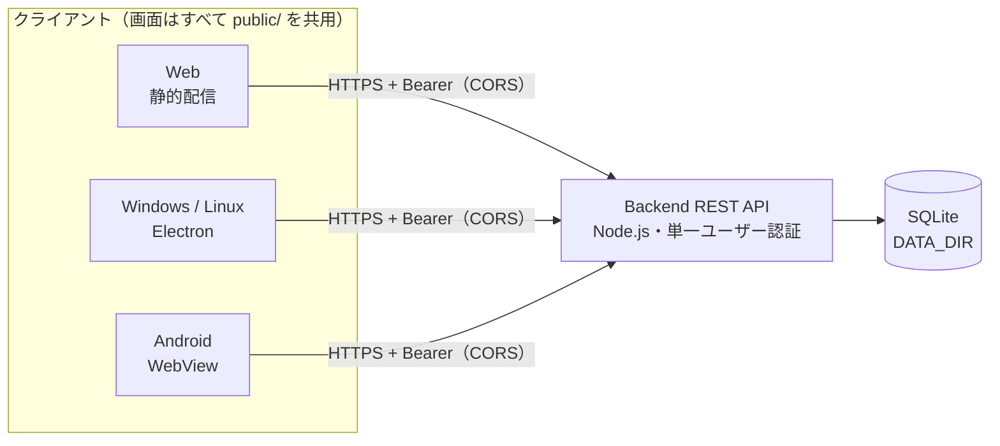

<div align="center">

# ✓ Best ToDo

**タスク・メモ・表を、ひとつのリストに。**<br>
セルフホストできる、日本語の単一ユーザー向けTo Doアプリ。

[](https://github.com/sanbungi/mytodo/actions/workflows/ci.yml)
[](https://github.com/sanbungi/mytodo/actions/workflows/build.yml)
[](https://github.com/sanbungi/mytodo/releases)


[機能](#-機能) ·
[クイックスタート](#-クイックスタート) ·
[クライアント](#-クライアント) ·
[デプロイ](#-デプロイ) ·
[API](#-api) ·
[開発](#-開発)


<sub>15秒ダイジェスト · ▶ <a href="docs/assets/demo.mp4">字幕付きのフルデモ（約77秒）を見る</a></sub>

</div>

## ✨ 機能

- **3種類の項目を同じリストに** — タスク・メモ・表（1〜20列）を混在させて管理
- **タスクを具体化** — ステップ（サブタスク）、期限、詳細メモ、重要、今日の予定
- **すばやい入力** — `Enter` でタスク登録、`Ctrl + Enter` でメモ保存
- **検索と並べ替え** — 全リスト横断の検索、期限順などの並び替え、ドラッグで手動並べ替え
- **CSV インポート / エクスポート** — 全リストをUTF-8のCSVで書き出し・取り込み
- **どこからでも同じデータ** — Web・Windows・Linux・Androidのクライアントが同じAPIを共有
- **セルフホスト前提の軽量構成** — Node.js + SQLiteの単一プロセス。外部DB不要、Dockerイメージあり
- **安全側の既定値** — 単一ユーザー認証、CORSは明示許可のみ、ログイン試行制限

<details>
<summary><b>📺 デモの収録内容</b></summary>

| #   | 場面                                          |
| --- | --------------------------------------------- |
| 01  | リストを作成して、仕事を整理                  |
| 02  | タスクを入力して `Enter` で登録               |
| 03  | ステップ・期限・メモで、作業を具体化          |
| 04  | 完了したタスクはチェックで管理                |
| 05  | メモも同じリストへ（`Ctrl + Enter` で保存）   |
| 06  | 表で情報を整理（列を増やして `Enter` で登録） |
| 07  | 検索で、必要なタスク・メモ・表を探す          |
| 08  | 並び順を切り替えて、期限を確認                |
| 09  | 再読み込みしても、入力内容を保持              |


デモ動画はPlaywrightで実際のUIを操作して自動生成しています。→ [デモ動画の生成](#デモ動画の生成)

</details>

## 🚀 クイックスタート

Node.js **22.13以降** が必要です。

```sh
git clone https://github.com/sanbungi/mytodo.git
cd mytodo
npm ci
cp .env.example .env   # AUTH_USERNAME / AUTH_PASSWORD を変更
npm run dev            # バックエンド → http://127.0.0.1:3000
```

別のターミナルでフロントエンドを起動します。

```sh
npm run dev:frontend   # フロントエンド → http://127.0.0.1:8080
```

http://127.0.0.1:8080 を開き、ログイン画面で次を入力します。

| 項目        | 値                                                   |
| ----------- | ---------------------------------------------------- |
| Backend URL | `http://127.0.0.1:3000`（`/api` を含めないオリジン） |
| ユーザー名  | `.env` の `AUTH_USERNAME`                            |
| パスワード  | `.env` の `AUTH_PASSWORD`                            |

> [!TIP]
> `.env.example` は `SEED_DATA=true`・`DATA_DIR=./data-dev` なので、表示確認用のサンプルデータ入りで始まります。詳しくは[開発用seed](#開発用seedと既存データ)を参照してください。

## 🏗 アーキテクチャ



フロントエンド（静的ファイル配信）とバックエンド（認証付きREST API / SQLite）は**独立して起動・デプロイ**します。接続先URLはビルド時に埋め込まず、利用者がログイン時に指定します。同じバックエンドに接続すれば、どのクライアントでもタスクを共有できます。

| コマンド                                          | 内容                                                                      |
| ------------------------------------------------- | ------------------------------------------------------------------------- |
| `npm start`                                       | バックエンド。`.env` があれば読み込み、実行環境で設定済みの環境変数を優先 |
| `npm run dev`                                     | `.env` を読み込むバックエンド（watch付き）                                |
| `npm run start:frontend` / `npm run dev:frontend` | フロントエンド。環境変数は実行環境から設定                                |

## 📱 クライアント

| プラットフォーム | 形態                      | 入手方法                                                                   |
| ---------------- | ------------------------- | -------------------------------------------------------------------------- |
| Web              | 静的配信                  | `npm run start:frontend` / Dockerイメージ                                  |
| Windows          | Electron（NSIS, x64）     | [Releases](https://github.com/sanbungi/mytodo/releases) / ソースからビルド |
| Linux            | Electron（AppImage・deb） | [Releases](https://github.com/sanbungi/mytodo/releases) / ソースからビルド |
| Android          | WebView（APK）            | [Releases](https://github.com/sanbungi/mytodo/releases) / ソースからビルド |

どのクライアントもバックエンドは内蔵せず、Web版と同じAPIへログインします。**画面の正は `public/`** で、各クライアント専用のHTML/CSS/画面ロジックはありません。

### デスクトップ版（Electron）

```sh
npm ci
npm run desktop       # 起動
npm run dev:desktop   # public/ の保存で自動再読み込みする開発モード
```

バックエンドの `CORS_ORIGINS` に **`http://127.0.0.1:17880`** を追加して再起動してください。Web版も使う場合はカンマで併記します。

```text
CORS_ORIGINS=https://todo.example.com,http://127.0.0.1:17880
```

ローカルAPIを使う場合は別ターミナルで `npm run dev` を起動し、ログイン画面で `http://127.0.0.1:3000` と `.env` の認証情報を入力します。リモートAPIへはHTTPSを使用してください。

<details>
<summary><b>ビルド・テスト</b></summary>

Windows版（NSIS、x64）はWindows上、Linux版（AppImage・deb）はLinux上で実行します。初回はElectron・NSIS等のダウンロードにネット接続が必要です。

```sh
npm run pack:desktop         # dist/<os>-unpacked/ に実行可能なフォルダを生成
npm run build:desktop:win    # dist/ にNSISインストーラーを生成
npm run build:desktop:linux  # dist/ にAppImageとdebを生成
npm run test:desktop         # 実際のElectron起動テスト（GUI環境が必要。Linuxのヘッドレス環境では xvfb-run -a を付ける）
# パッケージ済みアプリを検証する場合
DESKTOP_EXECUTABLE=dist/linux-unpacked/best-todo npm run test:desktop
```

</details>

<details>
<summary><b>画面変更の反映・セキュリティ設計</b></summary>

- Web版とElectron版で `src/frontend-server.js` の静的配信処理を共用。`public/` 内のサブディレクトリや画像も配信できます。
- `dev:desktop` では `public/` の保存で自動再読み込み（未保存の入力は失われます）。Electron本体や配信処理を変更した場合は再起動します。
- 配布版にはビルド時点の `public/` を同梱。画面更新の配布には再ビルド・再インストールが必要です。Webサイトの更新を遠隔で取り込む機能や自動アップデートは実装していません。
- コード署名は未設定なので、配布先ではSmartScreenの警告が出ることがあります。`data/`、`.env`、APIサーバーは同梱しません。SQLiteは引き続きバックエンドで管理されます。認証トークンはWeb版と同じsessionStorageで、アプリ終了後は再ログインします。
- Electronはループバックの固定ポート17880だけで画面を配信します。ポート競合時はエラーを表示して終了し、既存のサーバーは読み込みません。多重起動は既存ウィンドウを表示します。
- Node.js連携は無効、sandbox/contextIsolationは有効。外部ページへの移動・新規ウィンドウ・権限要求は禁止しています。メニューはAltで表示できます。

</details>

### Android版（WebView）

`android/` が既存の `public/` を表示するAndroidクライアントです。

- Androidビルド時に `public/` を `android/app/src/main/assets/public` へコピーします。
- アプリ内のフロントエンドOriginは `https://todo.local` です。バックエンドの `CORS_ORIGINS` にこのOriginを追加してください。
- `usesCleartextTraffic=false`、WebViewもmixed content禁止です。本番バックエンドはHTTPSで指定してください。

```sh
# Android SDK / JDK 17以上がある環境で実行
cd android
./gradlew assembleDebug      # 開発用（httpのバックエンドにも接続可）
./gradlew testDebugUnitTest  # アセット配信処理のテスト
```

バージョンは `package.json` の `version` から決まります（versionCodeは `major*10000+minor*100+patch`）。release APKは環境変数 `ANDROID_KEYSTORE_FILE` などでkeystoreを指定するとその鍵で署名され、未指定の場合はdebug鍵で署名されます。Android Studioで `android/` を開いてビルドすることもできます（初回はAndroid Gradle Plugin等のダウンロードにネット接続が必要）。

## ⚙️ 設定

| 対象    | 名前            | 内容                                                                                                                         |
| ------- | --------------- | ---------------------------------------------------------------------------------------------------------------------------- |
| 両方    | `HOST`          | 待受アドレス。ローカル既定 `127.0.0.1`、Docker既定 `0.0.0.0`                                                                 |
| 両方    | `PORT`          | バックエンド既定 `3000`、フロントエンド既定 `8080`                                                                           |
| Backend | `DATA_DIR`      | SQLite保存先。既定 `./data`、Dockerでは `/data`                                                                              |
| Backend | `AUTH_USERNAME` | **必須**。単一ユーザーの名前                                                                                                 |
| Backend | `AUTH_PASSWORD` | **必須**。12文字以上。本番では十分長いランダム値を使用                                                                       |
| Backend | `CORS_ORIGINS`  | 許可するフロントエンドのオリジンをカンマ区切りで指定。末尾スラッシュなし。既定はブラウザからのクロスオリジン接続を許可しない |
| Backend | `SEED_DATA`     | `true`のときのみ開発サンプルを投入。既定は無効。productionでは使用不可                                                       |
| Backend | `NODE_ENV`      | 本番では `production`（Dockerで設定済み）                                                                                    |

### 認証

- ユーザー登録画面はありません。起動時に環境変数から1ユーザーを設定し、パスワードはメモリ内でscryptハッシュとして照合します。変更にはバックエンド再起動が必要です。パスワードは保存しません。
- ログインするとBearerトークンを発行します（有効期間の既定は24時間。「サーバー管理」画面で変更可能）。トークンはブラウザのsessionStorage、セッションはサーバーのメモリ内に保存され、ログアウト・期限切れ・サーバー再起動で無効になります。
- ログイン失敗10回でサーバー全体に60秒の待機制限がかかります。

### 開発用seedと既存データ

本番の新規DBには空の標準リスト「タスク」のみ作成します。開発用サンプルは `src/seed.js` にあり、`SEED_DATA=true` のときだけ投入されます。

- seedはトランザクション内で一度だけ適用され、削除済みサンプルを再投入しません。
- サンプルは `demo-v1`（アイディア一覧）と `demo-v2`（メモ・表・期限・ステップ・日付リストなど表示確認用）に分かれ、未適用の分だけ投入されます。日付は投入した日を基準にします。
- やり直す場合は開発サーバーを止め、開発用データディレクトリだけを削除してください。
- 既存DBの項目は自動削除しません。以前のサンプルも保持されるため、不要なものは画面から削除するか、本番用に新しい保存先を指定してください。

## 📦 デプロイ

バックエンドとフロントエンドは別々のコンテナとして動かします。`v*` タグごとにGHCRへイメージを公開しています。

- `ghcr.io/sanbungi/mytodo-backend`
- `ghcr.io/sanbungi/mytodo-frontend`

タグは `sha-<完全なcommit SHA>`（運用ではこちらを推奨）、`latest`、バージョン（例: `1.2.3`）です。

> [!IMPORTANT]
> バックエンドは **1レプリカ** で運用してください。SQLite・メモリ内セッションのため水平スケールには対応していません。本番の認証情報をHTTPで送らないでください。

### CapRover

1. `todo-backend` / `todo-frontend` の2アプリを作成。
2. Container HTTP Portをバックエンド `3000`、フロントエンド `8080` に設定。
3. バックエンドに永続ディレクトリ `/data` を追加（Named Volume推奨）。コンテナは非rootのnodeユーザー（UID 1000）で動作するので、ホストディレクトリを使う場合は書き込み権限を付与。
4. バックエンドの環境変数に `AUTH_USERNAME`、`AUTH_PASSWORD`、`CORS_ORIGINS=https://todo.example.com` を設定。`SEED_DATA`は未設定または `false`。
5. 両アプリにドメインを設定し、HTTPSを有効化・強制。利用者はフロントエンド画面で `https://api.example.com` にログイン。
6. 各アプリのDeploymentで上記のイメージ名を指定してデプロイ。非公開GHCRの場合はCapRoverにGHCRレジストリ認証（read:packagesを持つ資格情報）を設定します。

Backend URLはブラウザから到達可能な公開URLです。CapRover内部のサービス名は指定しません。CORSには実際に利用するフロントエンドのスキーム・ホスト・ポートを正確に指定してください。

ソースからビルドする場合は、各アプリでCaptain Definitionのパスに `captain-definition.backend` / `captain-definition.frontend` を指定できます。

### バックアップ

バックエンドを停止し、`/data` 全体（SQLite/WALを含む）をコピーします。復元先でもnodeユーザーの書き込み権限が必要です。

## 🔌 API

`GET /api/health` と `POST /api/auth/login` は認証不要。それ以外のAPIは `Authorization: Bearer <token>` が必要です。

| Method         | Path               | 内容                                               |
| -------------- | ------------------ | -------------------------------------------------- |
| GET            | /api/health        | ヘルスチェック                                     |
| POST           | /api/auth/login    | `{username,password}` → `{token,username}`         |
| POST           | /api/auth/logout   | 現在のセッション失効                               |
| GET / POST     | /api/lists         | リスト取得 / 作成（name）                          |
| PATCH / DELETE | /api/lists/:id     | 名前変更 / 削除                                    |
| GET / POST     | /api/tasks         | 全項目取得 / 作成                                  |
| POST           | /api/tasks/reorder | `{id,targetId,position: "before" または "after"}`  |
| PATCH / DELETE | /api/tasks/:id     | 更新 / 削除                                        |
| POST           | /api/import        | `{items}`（1〜10000件）を一括追加。CSVインポート用 |

- 作成は `listId` と `kind`（省略時task）。taskは `title`、memoは `note`、tableは `cells`（1〜20列）が必要です。
- 更新は `title`, `listId`, `completed`, `important`, `myDay`, `dueDate`, `note`, `steps`, `cells`。日付は `YYYY-MM-DD` または空文字。メモ・表の完了操作は不可。
- エラーは `{error: "メッセージ"}`。

## 🛠 開発

```sh
npm ci
npx playwright install chrome
npm test               # API / E2E テスト
npm run format:check   # Prettier
```

API/E2Eは一時DBを使用します。E2Eは別ポートのフロントエンド・バックエンドを起動し、実際のログイン・CORS経由で操作を確認します。

### プロジェクト構成

```text
.
├── public/                 # UI（全クライアント共通）、接続先指定・ログイン
├── src/
│   ├── server.js           # バックエンドAPI、DBマイグレーション
│   ├── auth.js             # 単一ユーザー認証・セッション
│   ├── seed.js             # 開発サンプル
│   ├── frontend.js         # 静的フロントエンドサーバー
│   └── frontend-server.js  # 静的配信処理（Web / Electron 共用）
├── electron/               # デスクトップ版
├── android/                # Android版（WebView）
├── test/                   # API / E2E / Electron テスト
├── artifacts/demo/         # デモ動画の自動生成
├── Dockerfile.backend      # バックエンドイメージ
└── Dockerfile.frontend     # フロントエンドイメージ
```

### CI / リリース

| Workflow                      | トリガー                  | 内容                                                                                                                                      |
| ----------------------------- | ------------------------- | ----------------------------------------------------------------------------------------------------------------------------------------- |
| `.github/workflows/ci.yml`    | 全ブランチへのpush・PR    | `format:check`、`npm test`、Electron起動テスト（xvfb）、AndroidのJUnitテスト                                                              |
| `.github/workflows/build.yml` | `v*` タグのpush・手動実行 | CI通過後、Windows / Linux / Android をビルド（Linux版は起動確認付き）、GHCRへイメージ公開、タグ時は `SHA256SUMS` 付きでGitHub Release作成 |

```sh
git tag v1.2.3 && git push origin v1.2.3
```

タグからバージョンが決まり、CI内で `package.json` とAndroidのversionName/versionCodeがそのタグの値になります（コミットはされません）。`-` を含むタグ（例: `v1.2.0-rc.1`）はprereleaseになります。GHCRの `latest` はタグ時とmainでの手動実行で付きます。Actionsからの本番自動デプロイは行いません。

<details>
<summary><b>Android release APK の署名鍵を設定する</b></summary>

Androidのrelease APKを常に同じ鍵で署名するには、リポジトリのSecretsに次の3つを登録します。未登録の場合は実行のたびに異なるdebug鍵で署名されるため、更新時にアンインストールが必要です。

```sh
# リポジトリ外に作成する（*.jks はgitignore済みだが、コミットしないこと）。対話入力は使わない
umask 077
openssl rand -base64 33 | tr -d '/+=\n' > ~/besttodo-release.password
export STOREPASS="$(cat ~/besttodo-release.password)"
keytool -genkeypair -keystore ~/besttodo-release.jks -alias besttodo -keyalg RSA -keysize 4096 \
  -validity 10000 -storepass:env STOREPASS -dname "CN=Best ToDo"
keytool -list -keystore ~/besttodo-release.jks -storepass:env STOREPASS -alias besttodo  # 開けるか確認
# gh secret set は値を標準入力で渡すと対話入力を求めない（printf で末尾改行を付けない）
base64 -w0 ~/besttodo-release.jks | gh secret set ANDROID_KEYSTORE_BASE64
printf '%s' "$STOREPASS" | gh secret set ANDROID_KEYSTORE_PASSWORD
printf '%s' besttodo | gh secret set ANDROID_KEY_ALIAS
```

PKCS12形式（keytoolの既定）では鍵のパスワードはkeystoreのパスワードと共通です。keystoreを失くすと同じ署名で更新できなくなるため、パスワードと一緒にバックアップしてください。

</details>

### デモ動画の生成

Web版の実操作をPlaywrightで録画し、日本語字幕付きの通常版と15秒ショート版をまとめて生成できます。

```sh
bash artifacts/demo/generate.sh
```

初回セットアップ、出力先、録画を省略する再編集方法は[デモ動画の生成マニュアル](artifacts/demo/README.md)を参照してください。README用の素材は `docs/assets/` にあり、動画を撮り直したら次のコマンドで更新します。

```sh
cp artifacts/demo/best-todo-demo.mp4 docs/assets/demo.mp4
cp artifacts/demo/final.png docs/assets/screenshot.png
ffmpeg -y -i artifacts/demo/best-todo-demo-short.mp4 \
  -vf "fps=12,scale=960:-1:flags=lanczos,split[a][b];[a]palettegen=max_colors=128:stats_mode=diff[p];[b][p]paletteuse=dither=bayer:bayer_scale=4:diff_mode=rectangle" \
  -loop 0 docs/assets/demo.gif
```

## 🤝 コントリビュート

Issue・Pull Requestを歓迎します。PRを送る前に次を確認してください。

1. `npm run format` で整形し、`npm test` が通ること
2. 画面の変更は `public/` で行うこと（全クライアントに反映されます）
3. 見た目が変わる変更は、可能ならスクリーンショットやデモ動画を添付すること
