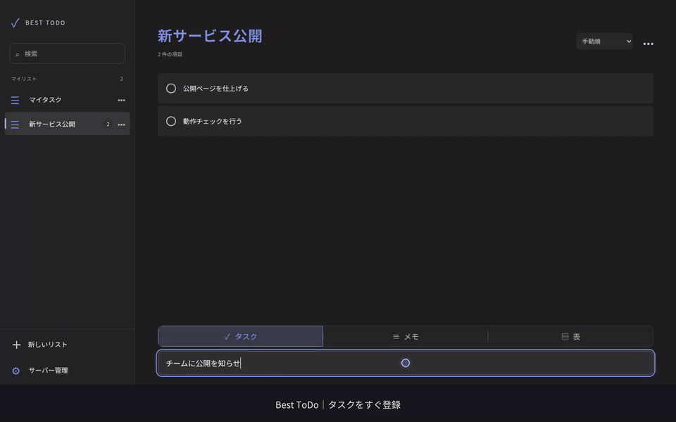
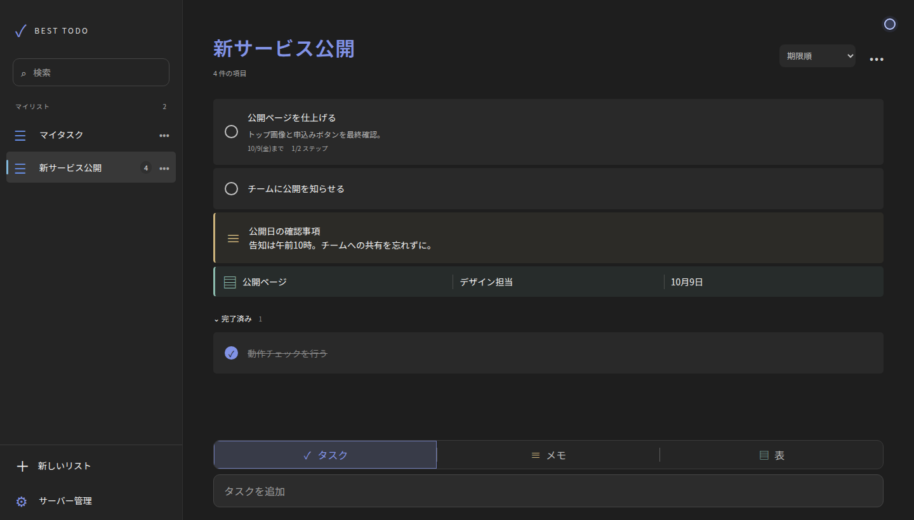

<div align="center">

# ✓ Best ToDo

**タスク・メモ・表を、ひとつのリストに。**<br>
セルフホストできる、日本語の単一ユーザー向けTo Doアプリ。

[](https://github.com/sanbungi/best-todo/actions/workflows/ci.yml)
[](https://github.com/sanbungi/best-todo/releases)
[](LICENSE)




<sub>15秒ダイジェスト · ▶ <a href="docs/assets/demo.mp4">字幕付きのフルデモ（約77秒）を見る</a></sub>

</div>

## ✨ 機能

- **3種類の項目を同じリストに** — タスク・メモ・表を混在させて管理
- **タスクを具体化** — ステップ、期限、詳細メモ、重要、今日の予定
- **すばやい入力** — `Enter` でタスク登録、`Ctrl + Enter` でメモ保存
- **検索と並べ替え** — 全リスト横断の検索、期限順の並び替え、ドラッグで手動並べ替え
- **CSV インポート / エクスポート** — データをいつでも持ち出せる
- **どこからでも同じデータ** — Web・Windows・Linux・Androidで同じサーバーに接続
- **軽量なセルフホスト** — Node.js + SQLiteだけで動作。外部DB不要、Dockerイメージあり



## 📥 入手

| プラットフォーム | 入手方法                                                                     |
| ---------------- | ---------------------------------------------------------------------------- |
| Web              | 自分のサーバーにデプロイ（[セルフホスト](docs/self-hosting.md)）             |
| Windows          | [Releases](https://github.com/sanbungi/best-todo/releases) のインストーラー  |
| Linux            | [Releases](https://github.com/sanbungi/best-todo/releases) の AppImage / deb |
| Android          | [Releases](https://github.com/sanbungi/best-todo/releases) の APK            |

どのクライアントも、ログイン画面で自分のサーバーのURLを指定して接続します。

## 🚀 クイックスタート

Node.js 22.13以降で、手元ですぐに試せます。

```sh
git clone https://github.com/sanbungi/best-todo.git && cd best-todo
npm ci
cp .env.example .env   # ユーザー名・パスワードを変更
npm run dev            # バックエンド（別ターミナルで npm run dev:frontend）
```

http://127.0.0.1:8080 を開き、Backend URLに `http://127.0.0.1:3000` と `.env` の認証情報を入力します。

本番運用は[セルフホストガイド](docs/self-hosting.md)を参照してください。

## 📚 ドキュメント

- [セルフホスト](docs/self-hosting.md) — Docker / CapRover、環境変数、CORS、バックアップ
- [開発ガイド](docs/development.md) — ローカル開発、テスト、デスクトップ / Android のビルド、リリース
- [REST API](docs/api.md) — エンドポイント一覧

## 🤝 コントリビュート

Issue・Pull Requestを歓迎します。始め方は[開発ガイド](docs/development.md#コントリビュート)を参照してください。

## 📄 ライセンス

[MIT](LICENSE)
