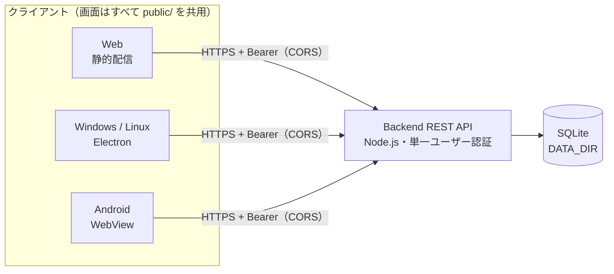

# セルフホスト

Best ToDoは、バックエンド（認証付きREST API / SQLite）とフロントエンド（静的ファイル配信）を**別々に**起動・デプロイします。接続先URLはビルド時に埋め込まず、利用者がログイン画面で指定します。



> [!IMPORTANT]
> バックエンドは **1レプリカ** で運用してください。SQLite・メモリ内セッションのため水平スケールには対応していません。本番の認証情報をHTTPで送らないでください。

## コンテナイメージ

`v*` タグごとにGHCRへイメージを公開しています。

- `ghcr.io/sanbungi/mytodo-backend`
- `ghcr.io/sanbungi/mytodo-frontend`

タグは `sha-<完全なcommit SHA>`（運用ではこちらを推奨）、`latest`、バージョン（例: `1.2.3`）です。`latest` はタグ時とmainでの手動実行で付きます。

バックエンドのコンテナは非rootのnodeユーザー（UID 1000）で動作し、`/data` にSQLiteを保存します。

## 環境変数

| 対象    | 名前                 | 内容                                                                                                                         |
| ------- | -------------------- | ---------------------------------------------------------------------------------------------------------------------------- |
| 両方    | `HOST`               | 待受アドレス。ローカル既定 `127.0.0.1`、Docker既定 `0.0.0.0`                                                                 |
| 両方    | `PORT`               | バックエンド既定 `3000`、フロントエンド既定 `8080`                                                                           |
| Backend | `DATA_DIR`           | SQLite保存先。既定 `./data`、Dockerでは `/data`                                                                              |
| Backend | `AUTH_USERNAME`      | **必須**。単一ユーザーの名前                                                                                                 |
| Backend | `AUTH_PASSWORD`      | **必須**。12文字以上。本番では十分長いランダム値を使用                                                                       |
| Backend | `CORS_ORIGINS`       | 許可するフロントエンドのオリジンをカンマ区切りで指定。末尾スラッシュなし。既定はブラウザからのクロスオリジン接続を許可しない |
| Backend | `SEED_DATA`          | `true`のときのみ開発サンプルを投入。既定は無効。productionでは使用不可                                                       |
| Backend | `NODE_ENV`           | 本番では `production`（Dockerで設定済み）                                                                                    |
| Backend | `DEMO_MODE`          | `true`で公開デモ環境として起動。[デモ環境](#デモ環境を公開する)を参照                                                        |
| Backend | `DEMO_RESET_MINUTES` | デモデータのリセット間隔（分）。1〜1440、既定 `60`                                                                           |

### CORS_ORIGINS に追加するオリジン

使うクライアントのオリジンをすべてカンマで併記します。スキーム・ホスト・ポートを正確に指定してください。

| クライアント       | オリジン                                                  |
| ------------------ | --------------------------------------------------------- |
| Web                | フロントエンドの公開URL（例: `https://todo.example.com`） |
| Windows / Linux 版 | `http://127.0.0.1:17880`                                  |
| Android 版         | `https://todo.local`                                      |

```text
CORS_ORIGINS=https://todo.example.com,http://127.0.0.1:17880,https://todo.local
```

デスクトップ版・Android版はバックエンドを内蔵せず、Web版と同じAPIへログインします。Android版（release）はHTTPのバックエンドに接続できないため、本番バックエンドはHTTPSで公開してください。

## 認証

- ユーザー登録画面はありません。起動時に環境変数から1ユーザーを設定し、パスワードはメモリ内でscryptハッシュとして照合します。変更にはバックエンド再起動が必要です。パスワードは保存しません。
- ログインするとBearerトークンを発行します（有効期間の既定は24時間。「サーバー管理」画面で変更可能）。トークンはブラウザのsessionStorage、セッションはサーバーのメモリ内に保存され、ログアウト・期限切れ・サーバー再起動で無効になります。
- ログイン失敗10回でサーバー全体に60秒の待機制限がかかります。

## データ

本番の新規DBには空の標準リスト「タスク」のみ作成します。`SEED_DATA` は未設定または `false` にしてください。既存DBの項目は自動削除しません。

## デモ環境を公開する

`DEMO_MODE=true` で起動すると、誰でも試せる公開デモ環境になります。通常の運用では設定しないでください。

- 起動時と `DEMO_RESET_MINUTES` ごとに全データを削除し、サンプルデータを入れ直します。日付は投入時点の今日を基準にします。ログイン中のセッションはリセット後も有効です。
- 認証情報の既定は `demo` / `demo` です（`AUTH_USERNAME` / `AUTH_PASSWORD` で変更可、12文字の制限なし）。ログイン失敗による待機制限はかかりません。
- `GET /api/demo`（認証不要）が認証情報と次回リセット時刻を返します。ログイン画面はこれを使って認証情報を自動入力し、ログイン後はリセット時刻を表示します。
- セッション設定の変更・他セッションのログアウトはできません（403）。リスト50件・項目1000件を超える追加は拒否します。
- 全訪問者が同じデータを共有します。永続ディレクトリは不要です。

フロントエンドのURLに `?backend=<バックエンドのURL>` を付けると接続先が入力済みになるので、READMEなどにはこの形で載せると1クリックで試せます。

```text
https://todo-demo.example.com/?backend=https://api-demo.example.com
```

## CapRoverで運用する

1. `todo-backend` / `todo-frontend` の2アプリを作成。
2. Container HTTP Portをバックエンド `3000`、フロントエンド `8080` に設定。
3. バックエンドに永続ディレクトリ `/data` を追加（Named Volume推奨）。ホストディレクトリを使う場合はUID 1000に書き込み権限を付与。
4. バックエンドの環境変数に `AUTH_USERNAME`、`AUTH_PASSWORD`、`CORS_ORIGINS=https://todo.example.com` を設定。
5. 両アプリにドメインを設定し、HTTPSを有効化・強制。利用者はフロントエンド画面で `https://api.example.com` にログイン。
6. 各アプリのDeploymentで[イメージ名](#コンテナイメージ)を指定してデプロイ。非公開GHCRの場合はCapRoverにGHCRレジストリ認証（read:packagesを持つ資格情報）を設定します。

Backend URLはブラウザから到達可能な公開URLです。CapRover内部のサービス名は指定しません。

ソースからビルドする場合は、各アプリでCaptain Definitionのパスに `captain-definition.backend` / `captain-definition.frontend` を指定できます。

## バックアップ

バックエンドを停止し、`/data` 全体（SQLite/WALを含む）をコピーします。復元先でもnodeユーザーの書き込み権限が必要です。

画面の「サーバー管理」から全リストをCSVでエクスポートすることもできます。
